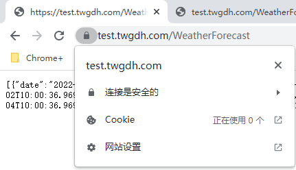

### 从零部署.NetCore到Linux

#### 购买Ubuntu服务器

1. 购买服务器

2. 创建root用户，设置密码

   ```sh
   # 创建root用户
   sudo passwd root
   # 输入两次密码
   ```

3. 启动ssh

   系统默认是关闭的，需要打开下。

#### 安装Nginx

> [如何在 Ubuntu 20.04 上安装 Nginx](https://developer.aliyun.com/article/759280)
>
> [sudo命令解释](https://www.cnblogs.com/danmiao/p/9993142.html)
>
> ​	sudo是linux系统管理指令，是允许系统管理员让普通用户执行一些或者全部的root命令的一个工具，如halt，reboot，su等等。这样不仅减少了root用户的登录 和管理时间，同样也提高了安全性。sudo不是对shell的一个代替，它是面向每个命令的。
>
> [apt命令详解](https://www.jianshu.com/p/e6f436f785ed)
>
> ​	apt的全称是Advanced Packaging Tool是Linux系统下的一款安装包管理工具。

Nginx在默认的Ubuntu源仓库中可用。想要安装它，运行下面的命令：

```sh
sudo apt update
sudo apt install nginx
```

一旦安装完成，Nginx会自动启动。你可以运行下面的命令来验证它：

```bash
sudo systemctl status nginx
```

#### 安装docker

> [Ubuntu Docker 安装](https://www.runoob.com/docker/ubuntu-docker-install.html)

安装命令如下：

```sh
curl -fsSL https://get.docker.com | bash -s docker --mirror Aliyun
```

#### 创建docker镜像并运行容器

1. 编写.NET Core Api 代码

2. 编写`Dockerfile`文件

   ```dockerfile
   #See https://aka.ms/containerfastmode to understand how Visual Studio uses this Dockerfile to build your images for faster debugging.
   
   FROM mcr.microsoft.com/dotnet/aspnet:6.0 AS base
   WORKDIR /app
   EXPOSE 80
   EXPOSE 443
   
   FROM mcr.microsoft.com/dotnet/sdk:6.0 AS build
   WORKDIR /src
   COPY ["twgdh.test.csproj", "."]
   RUN dotnet restore "./twgdh.test.csproj"
   COPY . .
   WORKDIR "/src/."
   RUN dotnet build "twgdh.test.csproj" -c Release -o /app/build
   
   FROM build AS publish
   RUN dotnet publish "twgdh.test.csproj" -c Release -o /app/publish
   
   FROM base AS final
   WORKDIR /app
   COPY --from=publish /app/publish .
   ENTRYPOINT ["dotnet", "twgdh.test.dll"]
   ```

3. 将代码和Dockerfile文件Copy到服务器。

   [利用ssh传输文件](https://www.cnblogs.com/jiangyao/archive/2011/01/26/1945570.html)

   Copy后服务器目录结构如下：

   ```sh
   root@VM-16-9-ubuntu:/home/root/twgdh.test/twgdh.test# tree
   .
   ├── appsettings.Development.json
   ├── appsettings.json
   ├── Controllers
   │   └── WeatherForecastController.cs
   ├── Dockerfile
   ├── Program.cs
   ├── Properties
   │   └── launchSettings.json
   ├── twgdh.test.csproj
   ├── twgdh.test.csproj.user
   ├── twgdh.test.sln
   └── WeatherForecast.cs
   ```
   
4. 构建镜像

   ```sh
   docker build -t twgdh.test .  # 注意最后有个点，表示当前目录
   ```

5. 运行容器

   ```sh
   docker run -d --name twgdh.test1.0 -p 8080:80 twgdh.test
   ```

6. 测试容器是否正常运行

   ```sh
   root@VM-16-9-ubuntu:~# curl -i "http://127.0.0.1:8080/WeatherForecast"
   HTTP/1.1 200 OK
   Content-Type: application/json; charset=utf-8
   Date: Fri, 29 Apr 2022 08:04:36 GMT
   Server: Kestrel
   Transfer-Encoding: chunked
   
   [{"date":"2022-04-30T08:04:37.1916863+00:00","temperatureC":44,"temperatureF":111,"summary":"Balmy"},{"date":"2022-05-01T08:04:37.1926873+00:00","temperatureC":-1,"temperatureF":31,"summary":"Warm"},{"date":"2022-05-02T08:04:37.1926914+00:00","temperatureC":1,"temperatureF":33,"summary":"Sweltering"},{"date":"2022-05-03T08:04:37.1926916+00:00","temperatureC":5,"temperatureF":40,"summary":"Cool"},{"date":"2022-05-04T08:04:37.1926918+00:00","temperatureC":45,"temperatureF":112,"summary":"Bracing"}]
   ```

#### 将域名指向服务器

​	修改域名的解析信息。

#### 配置Nginx请求转发

 1. 修改`/etc/nginx/nginx.conf`文件

    ```nginx
    ....
    events {
        ...
    }
    
    http {
        ....
        server {
            listen 		80;				# 监听80端口
            server_name	test.twgdh.com;	# 监听的域名
    
            location / {
                proxy_pass	http://127.0.0.1:8080;	# 转发到的地址
            }	
        }
        .....
    }
    ```

2. 重新加载nginx配置文件

   `nginx -s reload`

#### 测试使用域名访问容器中的网站

```sh
root@VM-16-9-ubuntu:~# curl -i "http://test.twgdh.com/WeatherForecast"
HTTP/1.1 200 OK
Server: nginx/1.18.0 (Ubuntu)
Date: Fri, 29 Apr 2022 08:52:02 GMT
Content-Type: application/json; charset=utf-8
Transfer-Encoding: chunked
Connection: keep-alive

[{"date":"2022-04-30T08:52:02.8364462+00:00","temperatureC":-12,"temperatureF":11,"summary":"Mild"},{"date":"2022-05-01T08:52:02.8364555+00:00","temperatureC":45,"temperatureF":112,"summary":"Hot"},{"date":"2022-05-02T08:52:02.836456+00:00","temperatureC":31,"temperatureF":87,"summary":"Cool"},{"date":"2022-05-03T08:52:02.8364562+00:00","temperatureC":29,"temperatureF":84,"summary":"Sweltering"},{"date":"2022-05-04T08:52:02.8364564+00:00","temperatureC":9,"temperatureF":48,"summary":"Mild"}]
```

#### 将站点配置为Https

> [nginx/1.18.0进行SSL证书配置](https://www.jianshu.com/p/b2b920685edb)
>
> [在Nginx（或Tengine）服务器上安装证书](https://help.aliyun.com/document_detail/98728.html)

1. 下载nginx证书

2. 上传证书文件到服务器

   ```sh
   C:\Users\Oliver-PC>scp -r C:\Users\Oliver-PC\Desktop\Temp\Nginx证书\5715401_test.twgdh.com_nginx root@test.twgdh.com:/etc/nginx/certificate
   root@test.twgdh.com's password:
   5715401_test.twgdh.com.key                                                            100% 1675    34.7KB/s   00:00
   5715401_test.twgdh.com.pem                                                            100% 3801    55.9KB/s   00:00
   ```

3. 修改nginx.conf 配置

   ```sh
   .....
   events {
   	.......
   }
   
   http {
   
   	.........
   	server {
   		listen 		80;
   		server_name	test.twgdh.com;
   
   		location / {
   			proxy_pass	http://127.0.0.1:8080;
   		}	
   	}
   
   	##
   	# SSL Settings
   	##
   	server {
   		listen 		443 ssl;
   		server_name	test.twgdh.com;
   
   		ssl_certificate   /etc/nginx/certificate/5715401_test.twgdh.com_nginx/5715401_test.twgdh.com.pem;
   		ssl_certificate_key  /etc/nginx/certificate/5715401_test.twgdh.com_nginx/5715401_test.twgdh.com.key;
   		ssl_session_timeout 5m;
   		ssl_protocols TLSv1 TLSv1.1 TLSv1.2;
   		ssl_ciphers ECDHE-RSA-AES128-GCM-SHA256:HIGH:!aNULL:!MD5:!RC4:!DHE;        
   		ssl_prefer_server_ciphers on;
   		location / {
   			proxy_pass	http://127.0.0.1:8080;
   		}	
   	}
   	.................
   }
   ```

4. 重新加载nginx配置文件

   `nginx -s reload`

5. 测试访问

   ​	

--至此大功告成--

